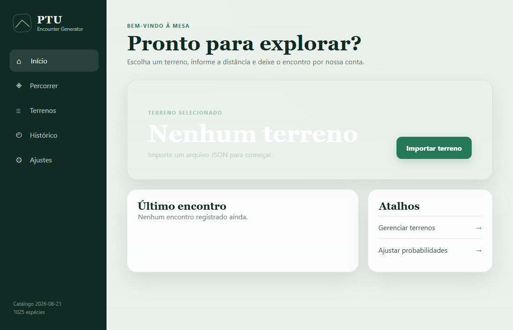

# PTU Encounter Generator

[](LICENSE)


Gerador offline de encontros aleatórios para sessões de Pokémon Tabletop United, disponível para Windows e Android. O aplicativo combina terreno, distância percorrida, raridade, nível, gênero, Nature PTU e chance de Shiny em um único sorteio.



## Funcionalidades

- terrenos personalizados importados por arquivos JSON;
- cálculo de encontro baseado na frequência do terreno e na distância percorrida;
- sorteio ponderado por raridade e níveis inclusivos;
- geração de gênero, Nature PTU e Shiny;
- catálogo local com 1.025 espécies-base;
- histórico de encontros e configurações persistentes;
- música MP3 opcional ao gerar um encontro;
- cache opcional de imagens dos Pokémon;
- interface responsiva em português para computador e celular.

O sorteio funciona sem internet. A conexão é usada apenas quando o usuário opta por baixar imagens para o cache local.

## Instalação

Os pacotes prontos são publicados na seção **Releases** do repositório:

- Windows: instalador `PTU-Encounter-Generator-Setup-x64.exe`;
- Android ARM64: `PTU-Encounter-Generator-arm64-release.apk`.

No Android, a instalação do APK pode exigir a permissão temporária para instalar aplicativos de fontes externas. Baixe somente arquivos publicados neste repositório.

## Como usar

1. Abra o aplicativo e acesse **Terrenos**.
2. Importe um arquivo JSON válido.
3. Selecione o terreno importado.
4. Acesse **Percorrer** e informe a distância.
5. Toque em **PERCORRER** para verificar e, quando houver, gerar o encontro.
6. Consulte os resultados anteriores em **Histórico**.

Um terreno pronto para teste está em [`test-files/pokemon-yellow-route-1.json`](test-files/pokemon-yellow-route-1.json). Consulte também o [guia ilustrado em PDF](docs/Guia-do-Usuario-PTU-Encounter-Generator-v0.1.2.pdf); a [versão HTML editável](docs/GUIA_DO_USUARIO.html) pode ser aberta diretamente no navegador.

## Formato dos terrenos

Cada terreno é um arquivo `.json`. Este é um exemplo mínimo:

```json
{
  "schema_version": "1.0",
  "terrain": {
    "name": "Nome do terreno",
    "min_lvl": 2,
    "max_lvl": 5,
    "encounter_frequency": "normal",
    "shiny_rate": null,
    "pokemon_table": [
      {
        "number": 16,
        "rarity": "common",
        "gender": true,
        "male_odd": null,
        "min_lvl": null,
        "max_lvl": null
      },
      {
        "number": 19,
        "rarity": "unusual",
        "gender": true,
        "male_odd": null,
        "min_lvl": null,
        "max_lvl": null
      }
    ]
  }
}
```

Os colchetes de `pokemon_table` delimitam a lista, e cada bloco entre chaves representa um Pokémon. Use o número da National Dex em `number`. Os valores aceitos em `rarity` são `common`, `unusual`, `rare`, `super_rare` e `legendary`. Para usar a taxa global de Shiny, escreva `"shiny_rate": null`, sem aspas em `null`. Consulte também:

- [exemplo comentado de terreno](examples/terrain.example.json);
- [JSON Schema oficial do projeto](src/schemas/terrain.schema.json);
- [especificação técnica](TECHNICAL_SPECIFICATION.md).

## Desenvolvimento

### Requisitos

- Node.js 24 e npm 11;
- Rust stable;
- Visual Studio Build Tools com o workload C++ para builds no Windows.

Instale as dependências e execute todas as verificações:

```sh
npm ci
npm run check
```

Inicie o aplicativo em modo de desenvolvimento:

```sh
npm run tauri dev
```

Gere o instalador para Windows:

```sh
npm run tauri build
```

As verificações também podem ser executadas em contêiner:

```sh
docker compose run --rm quality
```

### Build Android

O build Android reproduzível usa Docker e gera um APK ARM64. Crie uma chave de assinatura local uma única vez e faça o build:

```sh
node scripts/create-android-keystore.mjs
docker compose run --rm android
```

O resultado será criado em `artifacts/PTU-Encounter-Generator-arm64-release.apk`. Mantenha backup seguro de `keystores/android-release.jks` e `.env.android`; ambos são ignorados pelo Git e necessários para assinar atualizações compatíveis.

## Dados do catálogo

O catálogo versionado é derivado da [PokéAPI](https://pokeapi.co/) e usado localmente durante os sorteios. Para atualizar o snapshot:

```sh
npm run catalog:sync
```

Ajustes editoriais podem ser adicionados em `src/data/pokemon-catalog.overrides.json`.

## Contribuindo

Relatos de erros, sugestões e pull requests são bem-vindos. Antes de enviar uma alteração, execute:

```sh
npm run check
```

## Licença

O código deste projeto é distribuído sob a [Licença MIT](LICENSE).

## Aviso legal

Este é um projeto independente, gratuito e não oficial, sem afiliação com Nintendo, Game Freak ou The Pokémon Company. Pokémon e nomes relacionados pertencem aos seus respectivos titulares. A licença MIT cobre somente o código produzido neste repositório e não concede direitos sobre marcas, personagens, sistemas, dados ou materiais de terceiros. O projeto não inclui ROMs nem recursos extraídos dos jogos.
